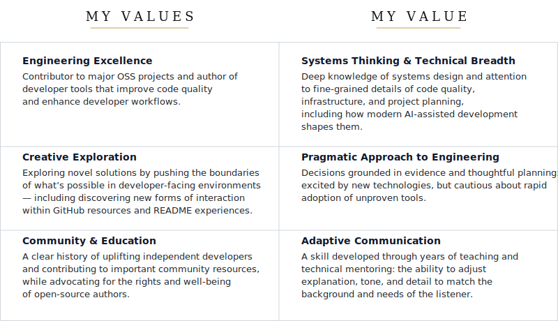

  <picture>
    <source media="(prefers-color-scheme: dark)" srcset="prod-assets/header_cyberpunk_glitch.svg">
    <source media="(prefers-color-scheme: light)" srcset="prod-assets/header_fashion_editorial.svg">
    
  </picture>

   

<picture>
  <source media="(prefers-color-scheme: light)" srcset="prod-assets/pixel_transparent.svg">
  <source media="(prefers-color-scheme: dark)" srcset="prod-assets/what-we-know-dark.svg">
  
</picture>

&nbsp;&nbsp;&nbsp;&nbsp;&nbsp;&nbsp;&nbsp;&nbsp;&nbsp;&nbsp;<picture>
  <source media="(prefers-color-scheme: light)" srcset="prod-assets/pixel_transparent.svg">
  <source media="(prefers-color-scheme: dark)" srcset="prod-assets/status_cyberpunk_projects.svg">
  
</picture>

<picture>
  <source media="(prefers-color-scheme: light)" srcset="prod-assets/pixel_transparent.svg">
  <source media="(prefers-color-scheme: dark)" srcset="prod-assets/recommendation-reach-out.svg">
  
</picture>

<picture>
  <source media="(prefers-color-scheme: light)" srcset="prod-assets/pixel_transparent.svg">
  <source media="(prefers-color-scheme: dark)" srcset="prod-assets/terminal_cyberpunk_reach_out_immediately.svg">
  
</picture>

<picture>
  <source media="(prefers-color-scheme: dark)" srcset="prod-assets/pixel_transparent.svg">
  <source media="(prefers-color-scheme: light)" srcset="prod-assets/table-divider.svg">
  
</picture>

<picture>
  <source media="(prefers-color-scheme: dark)" srcset="prod-assets/pixel_transparent.svg">
  <source media="(prefers-color-scheme: light)" srcset="prod-assets/two-column-table.svg">
  
</picture>

<picture>
  <source media="(prefers-color-scheme: dark)" srcset="prod-assets/pixel_transparent.svg">
  <source media="(prefers-color-scheme: light)" srcset="prod-assets/table-divider.svg">
  
</picture>

